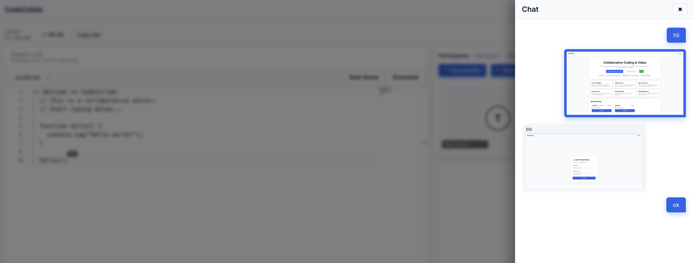
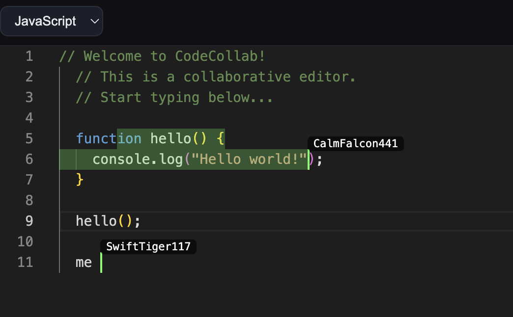

# CodeCollab

CodeCollab is a full-stack collaborative coding platform. It lets multiple users to join a shared room, code together in real time, communicate via chat and video calls, share screens — all in the browser.

## Features
- No Login room creation & sharing via secure URL link or custom Join Code.
- Dynamic Public & Private Rooms (optional password-protection for workspaces).
- Active Rooms live directory on the Homepage grid.
- Room capacity limits (1 to 10 participants per room).
- Automatic self-destructing Rooms (2 minutes to 1 hour durations).
- Custom user naming for private rooms (or auto-generated anonymous names).
- Real-time collaborative code editor (powered by Yjs + Monaco).
- Language selection (JavaScript, Python etc) with syntax highlighting.
- Download your code as a file.
- Integrated Chat with sliding sidebar interface & image upload support.
- Video calling with Mute/Unmute Mic and Video toggles with Picture-In-Picture & Grid layouts.
- Advanced Screen Sharing UI with Picture-In-Picture & Grid layouts.
- Universal Light/Dark mode switch across the entire app.

## Future Enhancements
- User authentication & persistent profiles.
- File sharing
- Scheduled rooms


### Demo






### How to start Locally
You will need Docker Engine to run the backend locally.

Make sure you install the dependencies first and start the frontend:

```bash
cd client && npm install
npm run dev
```

Run in root root project directory to start the backend services:
```bash
docker compose up -d --build
```


