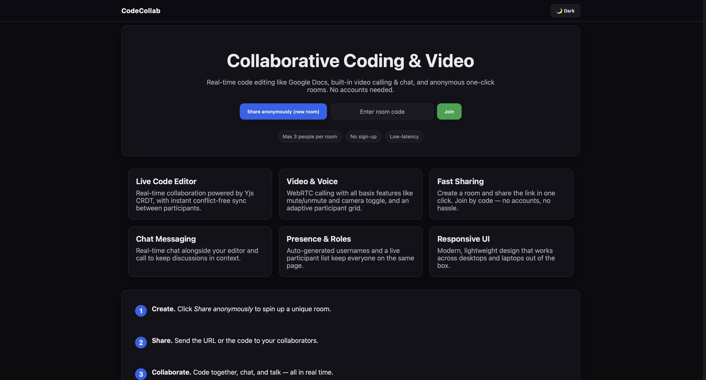
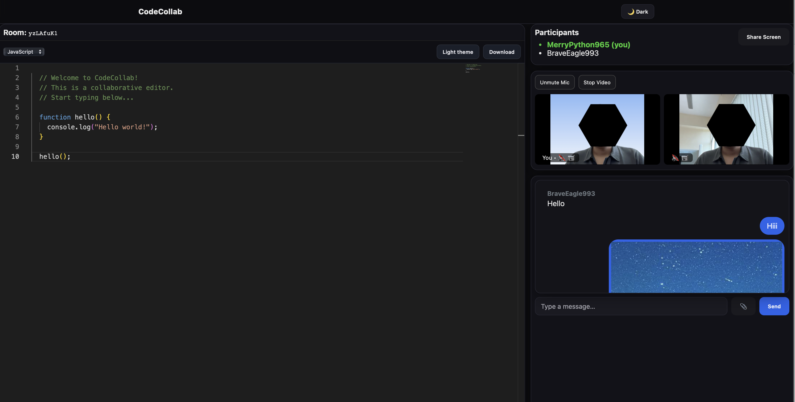
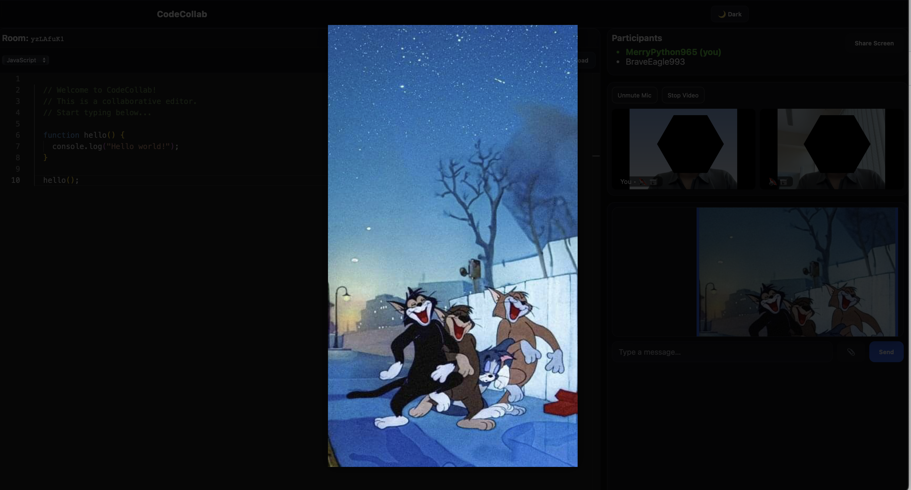
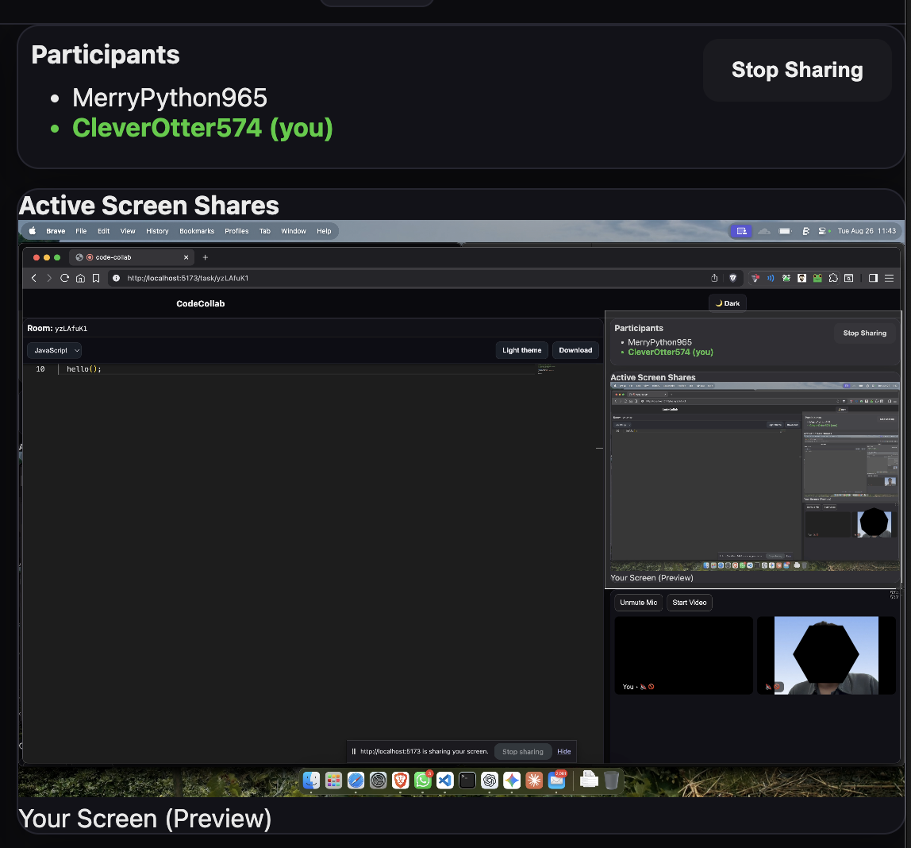
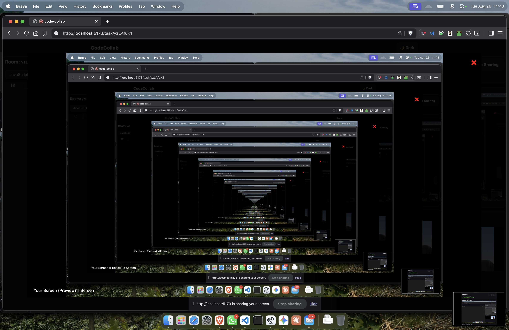

# CodeCollab

CodeCollab is a full-stack collaborative coding platform. It lets multiple users to join a shared room, code together in real time, communicate via chat and video calls, share screens — all in the browser.

## Features
- No Login Room creation & sharing via link or Join via code.
- Automatic user naming
- Max Limit 3 per room
- Dynamic room participant list with names
- Real-time collaborative code editor (powered by Yjs + Monaco)
- Language selection (JavaScript, Python etc) for syntax highlighting.
- Download your code buffer as a file
- Integrated chat and Video calling (Mute/unmute mic, toggle video)
- Universal Light/Dark mode switch across the app
- Screen Sharing
- Image sharing and view in Chat

## Future Enhancements
-	Live cursors + selection highlights
-	Persistent room history with database (MongoDB/Postgres)
-	Authentication & user profiles

### Demo

Clicking any image in Chat, opens it in full screen.

Whenever anyone is sharing his screen a seperated Active Screen Shares appears.

Clicking the shared screen will take you to full screen view.

